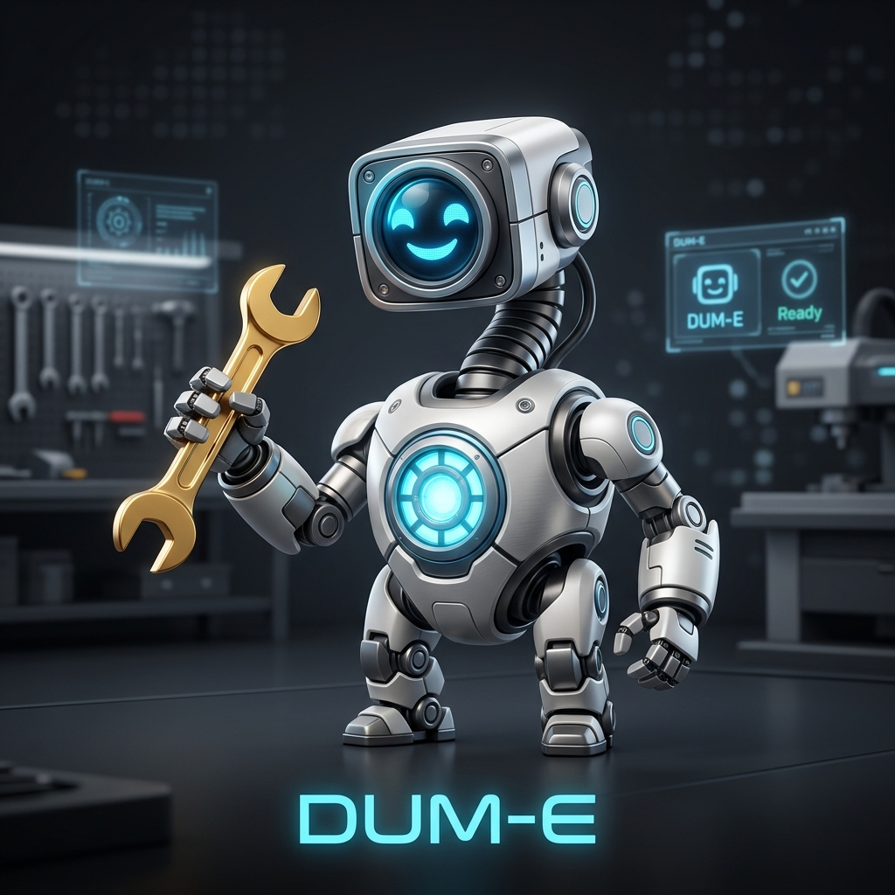
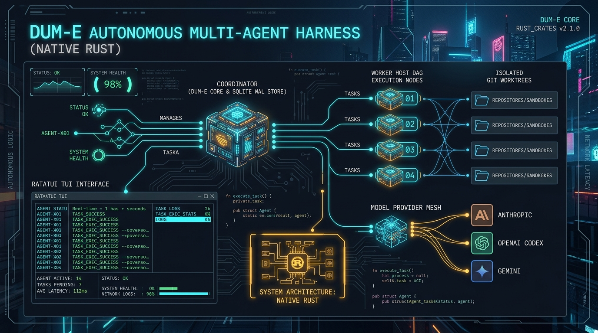
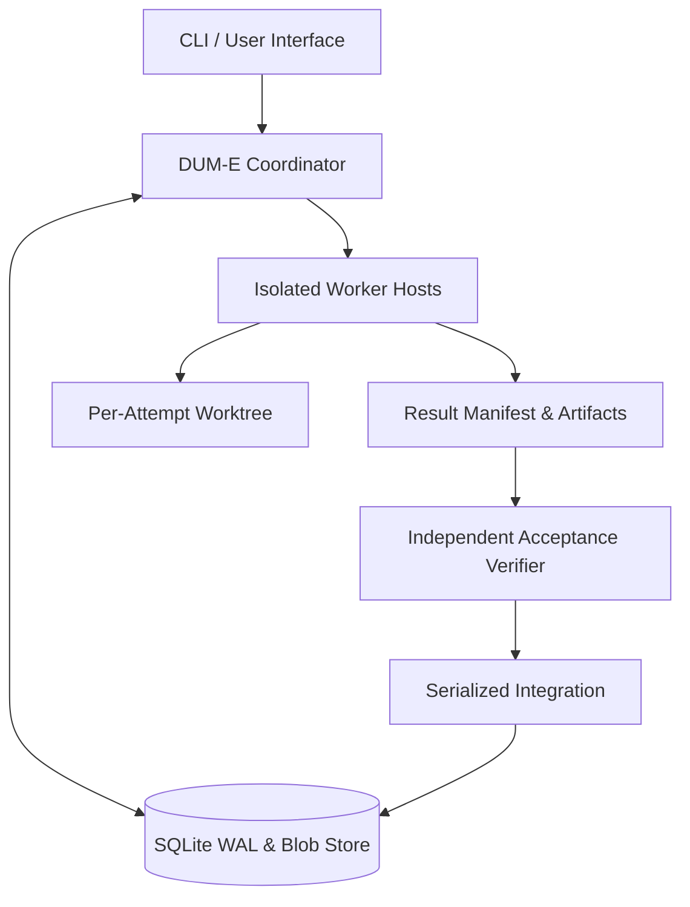

<p align="center">
  
</p>

<h1 align="center">D U M - E</h1>

<p align="center">
  <strong>Clean-Engine Autonomous Multi-Agent Harness</strong>
  <br/>
  <sub>Built on the pure Mario Zechner <code>pi</code> core with zero legacy baggage.</sub>
</p>

<p align="center">
  
  
  
  
</p>

---

## 🦾 DUM-E Mission

**DUM-E** is an autonomous multi-agent coding harness built for long-running, fault-tolerant missions. By choosing the **pure and clean `pi` foundation** rather than bloated monolithic forks, DUM-E achieves:

1. **Zero Legacy Overhead**: No vendor-specific locking, no leftover telegram/broker bloat, and minimal dependencies.
2. **Crash & Restart Recovery**: Preserves goals, attempts, and execution logs in an SQLite WAL store (`~/.dume/agent/harness.db`).
3. **Epoch Fencing Guard**: Strictly invalidates stale or zombie worker submissions, preventing race conditions or stale overwrites.
4. **DAG Task Orchestration**: Dynamically schedules multi-agent tasks respecting strict dependency graphs.
5. **Independent Verification**: Worker submissions are never auto-accepted. Independent acceptance criteria and modified path whitelists are verified before serialized integration.
6. **Hash-Addressed Blob Storage**: Offloads massive logs and changed blobs to content-addressable storage, avoiding prompt token exhaustion.

---

## 📦 Installation & Setup

### 1. One-line Standalone Installer (macOS & Linux, No Bun/Node required)
```bash
curl -fsSL https://raw.githubusercontent.com/jeongminsang/dum-e/main/scripts/install.sh | sh
```

### 2. From Source / Development
```bash
# Clone and install dependencies
git clone https://github.com/jeongminsang/dum-e.git
cd dum-e
bun install

# Link globally as `dume` CLI
bun --cwd=packages/coding-agent link
# Or compile local standalone binary
sh scripts/install.sh --dev
```

---

## 🚀 Quick Start & CLI Usage

DUM-E provides plan-first control with a **resilient autonomous multi-agent execution harness**:

```bash
# 1. Check DUM-E harness health & SQLite WAL subsystem
dume doctor

# 2. Start interactive coding session (DUM-E TUI)
dume

# 3. Create a durable multi-agent mission goal (DAG tracking)
dume goal \
  --title "Implement Distributed Auth" \
  --requirements "Setup JWT auth routes with verification"

# 4. Check active unfinished attempts
dume status

# 5. Non-interactive single-prompt execution
dume -p "Analyze project dependencies and list top 3 improvements"

# 6. Run autonomous harness test suite
bun run test
```

---

## 🏗️ Architecture

<p align="center">
  
</p>


