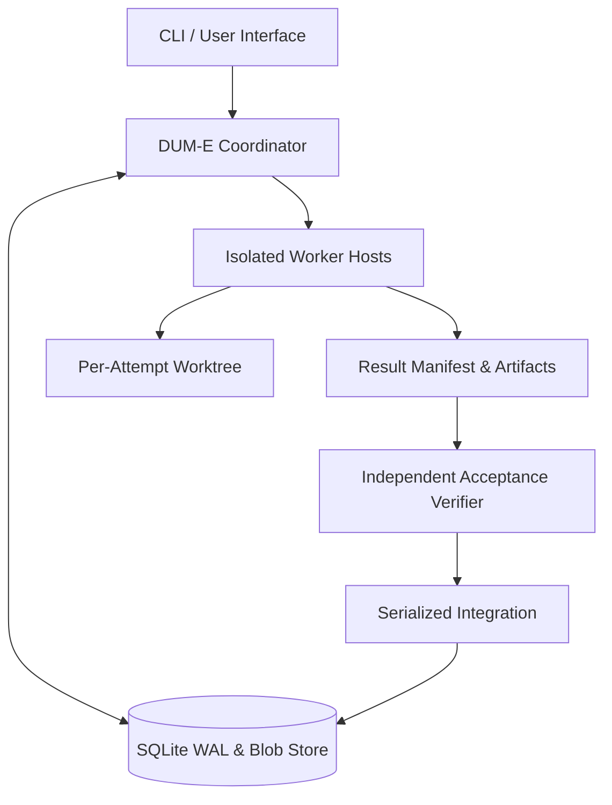

<p align="center">
  
</p>

<h1 align="center">D U M - E</h1>

<p align="center">
  <strong>Clean-Engine Autonomous Multi-Agent Harness (Native Rust)</strong>
  <br/>
  <sub>Pure native Rust architecture with zero legacy overhead and instant cold starts.</sub>
</p>

<p align="center">
  
  
  
  
</p>

---

## 🦾 DUM-E Mission

**DUM-E** is an autonomous multi-agent coding harness built in pure Rust for long-running, fault-tolerant missions:

1. **Zero Legacy Overhead**: Clean Rust crates (`dume-core`, `dume-store`, `dume-git`, `dume-worker`, `dume-mcp`, `dume-provider`, `dume-tui`, `dume-cli`).
2. **Instant Cold Start & Low Footprint**: < 20ms startup, ~8MB standalone binary without Node/Bun runtime overhead.
3. **Crash & Restart Recovery**: Preserves goals, attempts, and execution logs in an SQLite WAL store (`~/.dume/rust/harness.db`).
4. **Epoch Fencing Guard**: Strictly invalidates stale or zombie worker submissions, preventing race conditions or stale overwrites.
5. **DAG Task Orchestration**: Dynamically schedules multi-agent tasks respecting strict dependency graphs.
6. **Independent Verification**: Worker submissions are never auto-accepted. Independent acceptance criteria and modified path whitelists are verified in detached worktrees before serialized integration.
7. **Hash-Addressed Blob Storage**: Offloads massive logs and changed blobs to content-addressable storage, avoiding prompt token exhaustion.

---

## 📦 Installation & Setup

### Build from Source
```bash
# Clone repository
git clone https://github.com/jeongminsang/dum-e.git
cd dum-e

# Build release binary (native Rust)
cargo build --release

# Install binary to PATH
cargo install --path crates/dume-cli
```


---

## 🚀 Quick Start & CLI Usage

DUM-E provides plan-first control with a **resilient autonomous multi-agent execution harness**:

```bash
# 1. Start interactive coding session (DUM-E Ratatui TUI)
dume

# 2. Check DUM-E harness status
dume status

# 3. Start autonomous coordinator with state recovery
dume coordinator --repo-path .

# 4. Run autonomous workspace test suite
cargo test --workspace
```


---

## 🏗️ Architecture

<p align="center">
  
</p>


