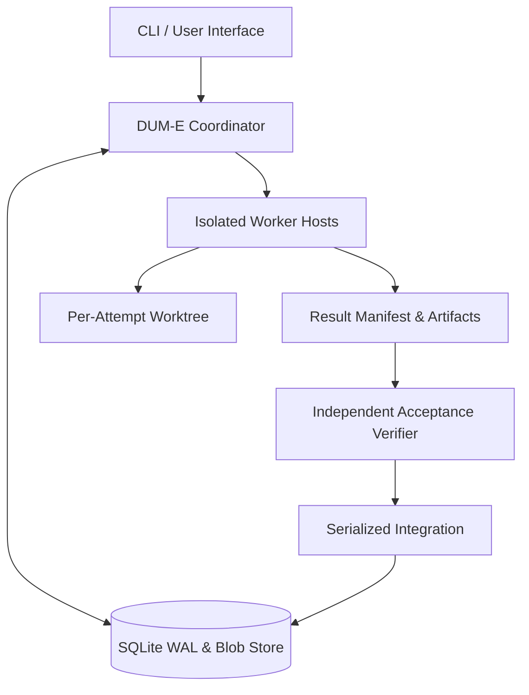

<p align="center">
  
</p>

<h1 align="center">D U M - E</h1>

<p align="center">
  <strong>Clean-Engine Autonomous Multi-Agent Harness (Native Rust)</strong>
  <br/>
  <sub>Native Rust executable with no Node or Bun runtime dependency.</sub>
</p>

<p align="center">
  
  
  
</p>

---

## DUM-E Mission

**DUM-E** is an autonomous multi-agent coding harness built in pure Rust for long-running, fault-tolerant missions:

1. **Zero Legacy Overhead**: Clean Rust crates (`dume-core`, `dume-store`, `dume-git`, `dume-worker`, `dume-mcp`, `dume-provider`, `dume-tui`, `dume-cli`).
2. **Native Distribution**: A standalone executable without Node/Bun runtime overhead. Binary size varies by platform and build.
3. **Crash & Restart Recovery**: Preserves goals, attempts, and execution logs in an SQLite WAL store (`~/.dume/rust/harness.db`).
4. **Epoch Fencing Guard**: Strictly invalidates stale or zombie worker submissions, preventing race conditions or stale overwrites.
5. **DAG Task Orchestration**: Dynamically schedules multi-agent tasks respecting strict dependency graphs.
6. **Independent Verification**: Worker submissions are never auto-accepted. Independent acceptance criteria and modified path whitelists are verified in detached worktrees before serialized integration.
7. **Hash-Addressed Blob Storage**: Offloads massive logs and changed blobs to content-addressable storage, avoiding prompt token exhaustion.

---

## Installation & Setup

### Install a release

Download the installer, inspect it, then run it:

```bash
curl -fsSL https://raw.githubusercontent.com/jeongminsang/dum-e/main/scripts/install.sh -o /tmp/dume-install.sh
sh /tmp/dume-install.sh
```

Use `--ref v<version>` to select an exact published native release. The installer
verifies `SHA256SUMS` before replacing `~/.local/bin/dume`; a missing release or
checksum mismatch fails without replacing the installed executable.
Windows releases contain `dume/dume.exe` in the matching native ZIP archive.

### Build from Source

Rust 1.96.0 is used by CI. Git is required for worktree operations.

```bash
# Clone repository
git clone https://github.com/jeongminsang/dum-e.git
cd dum-e

# Build release binary (native Rust)
cargo build --release --locked -p dume-cli

# Install binary to PATH
cargo install --locked --path crates/dume-cli
```

`sh scripts/install.sh --dev` builds the local Rust checkout and installs it to
`~/.local/bin`. No Node or Bun is used by either installation mode.

### Authentication

```bash
dume login anthropic
dume login openai-codex
dume login openai-codex --device
dume login openai --api-key
dume login google --api-key
dume logout openai-codex
```

Anthropic and OpenAI Codex support OAuth. `--manual` accepts a pasted browser
authorization result when a callback cannot be used. OpenAI API keys and Codex
subscriptions are separate identities and use different inference endpoints.
Google/Gemini uses an API key, **not OAuth**; `gemini` is an alias for `google`.
API keys may also be supplied through `ANTHROPIC_API_KEY`, `OPENAI_API_KEY`, or
`GEMINI_API_KEY`.

Select the provider explicitly when a model is available through multiple providers:

```bash
dume interactive --model anthropic/claude-sonnet-4-5
dume interactive --model openai-codex/gpt-5.4
dume models --provider openai-codex
```

Credentials are selected for the requested model, not by the first available
account. OAuth credentials are refreshed before expiry. Authentication and
credential-storage failures are reported instead of reusing expired tokens.
The embedded catalog includes metadata for providers beyond the currently wired
Anthropic, OpenAI, OpenAI Codex, and Google inference transports.

---

## Quick Start & CLI Usage

DUM-E provides plan-first control with a **resilient autonomous multi-agent execution harness**:

```bash
# 1. Start interactive coding session (DUM-E Ratatui TUI)
dume

# 2. Check DUM-E harness status
dume status

# 3. Start autonomous coordinator with state recovery
dume coordinator --repo-path .

# 4. Run autonomous workspace test suite
cargo test --workspace --locked
```

## Native releases

`release.yml` is the sole GitHub tag publisher. It validates that the `v<version>`
tag matches `Cargo.toml`, builds the exact tagged source on six native runners
(macOS/Linux/Windows, arm64/x64), smoke-tests the executables outside the checkout,
and publishes archives, licenses, a Rust-only source archive, and `SHA256SUMS`.
Published assets are not overwritten during recovery.

For an unpublished local archive, use a new output directory:

```bash
bash scripts/build-binaries.sh --out /tmp/dume-native-release
python3 scripts/test-native-install.py --archive /tmp/dume-native-release/dume-darwin-arm64.tar.gz --version 0.1.0
bash scripts/create-source-archive.sh --version 0.1.0 --out /tmp/dume-native-release/dume-0.1.0-source.tar.gz
```

Substitute the current workspace version and host platform. Packaging requires
Python 3.11+ in addition to Cargo; installed executables do not. `--offline` is
available for builds with a hydrated Cargo cache. The repository is 100% Rust
and publishes standalone native executables.

---

## Architecture

<p align="center">
  
</p>


