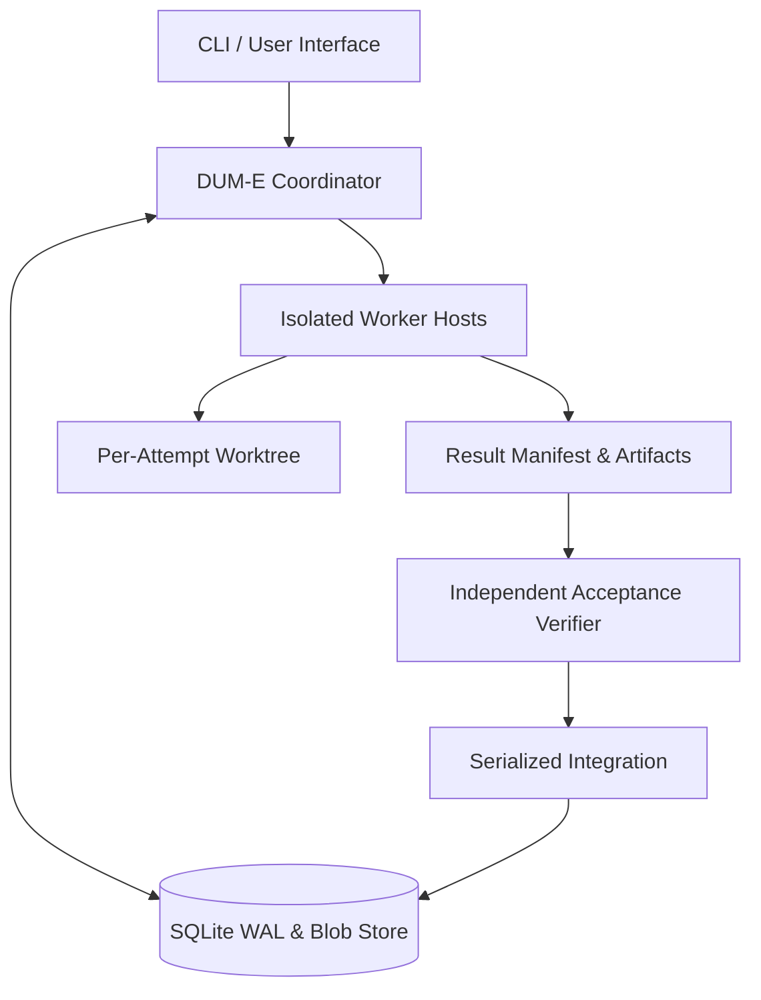

<p align="center">
  
</p>

<h1 align="center">D U M - E</h1>

<p align="center">
  <strong>Clean-Engine Autonomous Multi-Agent Harness (Native Rust)</strong>
  <br/>
  <sub>100% standalone native Rust executable with zero Node.js, Bun, or Python runtime dependencies.</sub>
</p>

<p align="center">
  
  
  
  
</p>

---

## DUM-E Mission

**DUM-E** is an autonomous multi-agent coding harness built from scratch in pure Rust for long-running, fault-tolerant missions:

1. **Zero Legacy Overhead**: Clean Rust modular crates (`dume-core`, `dume-store`, `dume-git`, `dume-worker`, `dume-mcp`, `dume-provider`, `dume-tui`, `dume-cli`).
2. **Native Distribution**: Single standalone binary without Node or Bun runtime dependencies.
3. **Crash & Restart Recovery**: Preserves goals, attempts, and execution logs in an SQLite WAL store (`~/.dume/rust/harness.db`).
4. **Epoch Fencing Guard**: Strictly invalidates stale or zombie worker submissions, preventing race conditions or stale overwrites.
5. **DAG Task Orchestration**: Dynamically schedules multi-agent tasks respecting strict dependency graphs.
6. **Independent Verification**: Worker submissions are never auto-accepted. Independent acceptance criteria and modified path whitelists are verified in detached git worktrees before serialized integration.
7. **Hash-Addressed Blob Storage**: Offloads massive logs and changed blobs to content-addressable storage, avoiding prompt token exhaustion.

---

## Installation & Setup

### Install a Prebuilt Release

Download and run the native installer script:

```bash
curl -fsSL https://raw.githubusercontent.com/jeongminsang/dum-e/main/scripts/install.sh -o /tmp/dume-install.sh
sh /tmp/dume-install.sh
```

Use `--ref v<version>` to select an exact published native release. The installer verifies `SHA256SUMS` before placing the binary in `~/.local/bin/dume`.

### Build from Source

Requirements: Rust toolchain (`cargo`), Git.

```bash
# Clone repository
git clone https://github.com/jeongminsang/dum-e.git
cd dum-e

# Build release binary (native Rust)
cargo build --release --locked -p dume-cli

# Install binary to PATH
cargo install --locked --path crates/dume-cli
```

Local development build and installation can also be run with:

```bash
sh scripts/install.sh --dev
```

---

## Authentication & Model Configuration

DUM-E supports OAuth (Anthropic, OpenAI Codex) with automatic token refresh, as well as API key authentication:

```bash
# OAuth login
dume login anthropic
dume login openai-codex
dume login openai-codex --device

# API Key login
dume login openai --api-key
dume login google --api-key

# Logout and credential management
dume logout openai-codex
```

API keys can also be supplied via environment variables (`ANTHROPIC_API_KEY`, `OPENAI_API_KEY`, `GEMINI_API_KEY`).

Specify the model provider when launching interactive sessions or checking catalogs:

```bash
# Start interactive TUI session with a specific model
dume interactive --model anthropic/claude-sonnet-4-5
dume interactive --model openai-codex/gpt-5.4

# Query catalog across 39 supported providers
dume models --provider openai-codex
dume models --provider deepseek
```

---

## CLI Usage

```bash
# 1. Start interactive coding session (DUM-E Ratatui TUI)
dume

# 2. Check DUM-E harness status
dume status

# 3. Start autonomous coordinator with state recovery
dume coordinator --repo-path .

# 4. Run workspace test suite offline
cargo test --workspace --locked --offline
```

---

## Architecture

<p align="center">
  
</p>



---

## Project Status & Contributions

This repository is developed and maintained for personal and dedicated internal use. External contributions, issues, and pull requests are not currently accepted.

---

## Acknowledgements

DUM-E's core concepts, protocol design, and architectural foundation originated from and were inspired by [pi](https://github.com/badlogic/pi) by [Mario Zechner](https://github.com/badlogic). DUM-E has since been fully re-architected and rewritten from the ground up as a 100% standalone native Rust engine.

---

## License

DUM-E is licensed under either of:
- Apache License, Version 2.0 ([LICENSE-APACHE](http://www.apache.org/licenses/LICENSE-2.0))
- MIT license ([LICENSE](LICENSE))

at your option.
